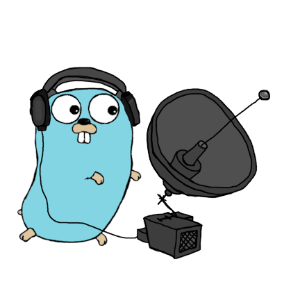

# __ShortWave__

#### Listen to shortwave radio over the internet through public **KiwiSDR** receivers — entirely from your terminal. No antenna, no radio hardware, no browser.

## __Getting Started__

#### Prerequisites : _Go 1.21+._

## Install via go

```sh
go install github.com/CHE3MZ/shortwave/cmd/shortwave@latest
```

---

## Or build from source:

```sh
git clone https://github.com/CHE3MZ/shortwave
cd shortwave
go build -o shortwave ./cmd/shortwave
```
##### Or Run Without Building

``` bash
go run ./cmd/shortwave
```

## Usage

```sh
shortwave --help                     # all flags
shortwave <server:8073> -f 9650 -m am
shortwave --example                  # = -f 7222 -m lsb -v 25
shortwave --example 2                # = -f 1010 -m lsb -v 25
shortwave --example 3                # = -f 1030 -m lsb -v 25
shortwave --random --volume 50       # random receiver + random frequency
shortwave --voice                    # random ham voice frequency
shortwave --scan --band 7100-7300    # find the strongest signals on 40m
shortwave --no-color                 # plain output for pipes/logs
```

Run `shortwave` with no arguments to reconnect to the last receiver you used.
State is saved to your OS config dir (`%AppData%\shortwave\config.json` on
Windows, `~/.config/shortwave/config.json` elsewhere) after the first
successful connection — nothing needs to exist beforehand. If a stale
`.shortwave.json` sits in your working directory from an older version,
delete it; it is no longer read.

### Interactive keys (while listening)

| Key | Action |
|-----|--------|
| `q` | quit |
| `+` / `-` | step 5 kHz up/down |
| `1` / `2` | step 1 kHz up/down |
| `<number>` | tune to a frequency in kHz (e.g. `9650`) |
| `m <mode>` | change mode (`am`, `usb`, `lsb`, `cw`, `nbfm`, ...) |
| `v <0-100>` | volume |
| `?` | status |

### Modes

`am`, `amn`, `amw`, `usb`, `usn`, `lsb`, `lsn`, `cw`, `cwn`, `nbfm`, `nnfm`, `sam`, `iq`.

Tip: below 10 MHz (80m/40m) ham uses **LSB**; above 10 MHz (20m/15m) uses **USB**; broadcast AM bands use **AM**. Hearing a robotic buzz usually means you're in the wrong mode or off-frequency.

## Project layout

```text
cmd/shortwave/      # binary entry point (thin main)
internal/
  cli/              # flag parsing (kong) + session orchestration
  app/              # listening session, server pool, scan, protocol test
  audio/            # local sound output (beep/oto resampling)
  bands/            # curated SW + ham voice band tables
  config/           # persisted last-server state (OS config dir)
  kiwi/             # KiwiSDR WebSocket protocol + IMA ADPCM codec
  ui/               # lipgloss terminal styling (banner, status, tables)
  version/          # release version in one place
scripts/ops/        # quality gates (bugcheck + seccheck)
tools/              # one-shot build scripts per OS
```

Quality gates (all currently passing):

```sh
golangci-lint run ./...   # via scripts/ops/go-bugcheck.sh
go vet ./... && go test ./...
gosec ./...               # via scripts/ops/go-seccheck.sh
```

## How it works

Shortwave receivers are physical hardware, so this tool doesn't receive anything itself. Instead it is a client for the **KiwiSDR** protocol: public volunteer-hosted receivers expose a WebSocket that streams demodulated audio, and `shortwave` handles the protocol — auth, tuning, the IMA ADPCM audio codec, and playback — so you get live radio in your terminal.

It connects to any public KiwiSDR (usually port `8073`). You can find live receivers on [kiwisdr.com](https://www.kiwisdr.com) or just use `--random`.

## Notes

- **Receive only.** This tool never transmits; no license needed to listen. Respect your local laws and each receiver's usage policy.
- Public receivers are shared — a receiver may be busy or temporarily reject new connections. `--random` retries a few.
- Several servers on kiwisdr.com are actually OpenWebRX boxes with a different protocol; `shortwave` currently supports KiwiSDR servers.

## License

[MIT](LICENSE) © 2026 CHE3MZ